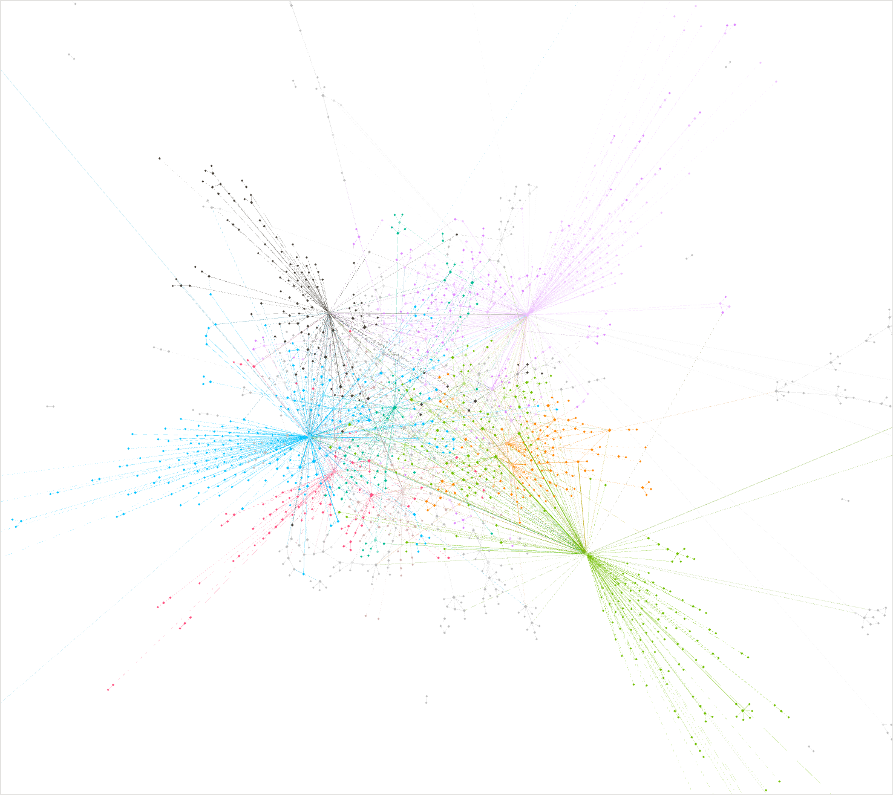
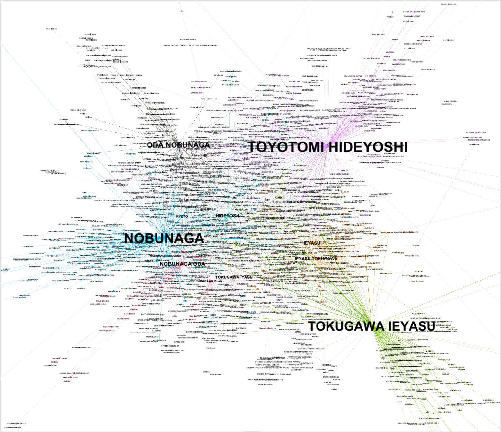
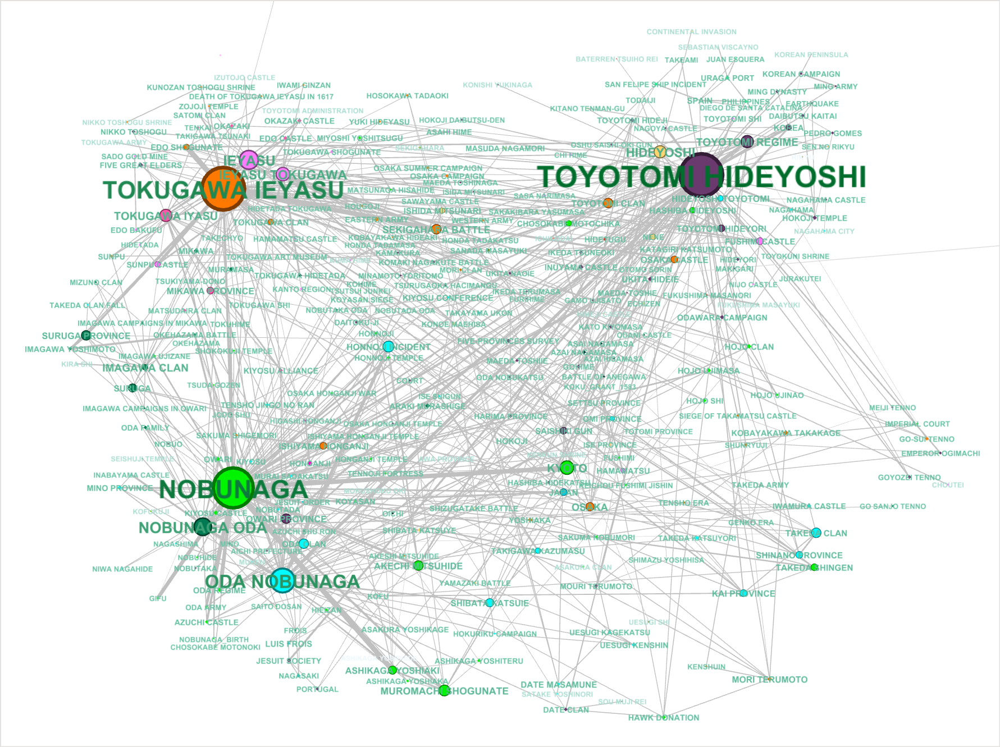
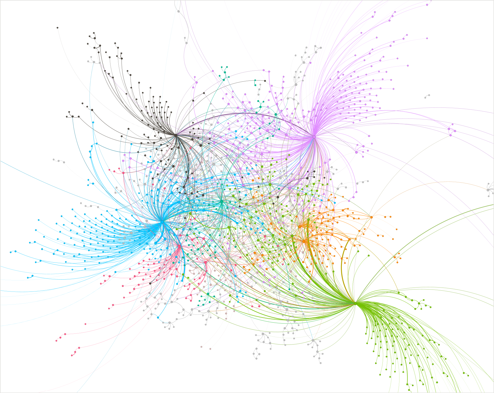
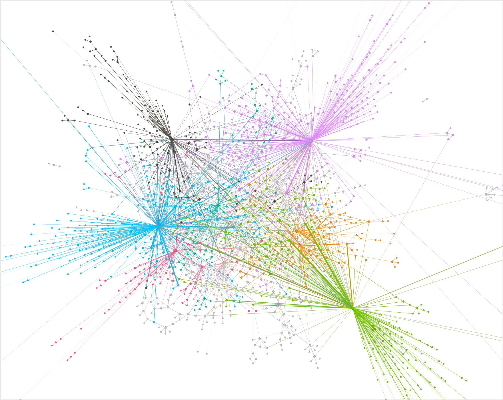

#### 最終更新日: Feburary 16, 2026

# 1. 本リポジトリの説明

昨今の LLM 利用の普及に伴い同時に注目度の高くなっている RAG (Retrieval-Augmented Generation)。本リポジトリーはその1手法である Knowledge Graph を利用した [Microsoft GraphRAG][ms_graphrag_official_top] (version 3.0.1) を動作させてみた結果を個人的に記録したものです。  
なお Microsoft 社、および Microsoft GraphRAG を実装した Microsoft Research の公式見解ではありません。

# 2. Knowledge Graph と RAG

## 2-1. Knowledge Graph

Knowledge Graph は LLM の認知度が高まり、同じく RAG (Retrieval-Augmented Generation)[^1] が注目されるようになる以前の2000年代初頭から、Semantic Web の文脈で発展してきた技術です。[^2]  
構成要素として主に次のような種類があります。

- `ノード (Node)`: グラフの「点」に当たる部分で、**実体（エンティティ）**を表します。人物・企業・場所・製品・概念などがノードになり得ます。
- `エッジ (Edge)`: ノード同士を結ぶ「線」で**関係（リレーション）**を表します。ナレッジグラフでは、エッジに通常、**意味（関係の種類）**が明示されます。
- `エッジの向き (Directed/Undirected)`: 多くのナレッジグラフは**有向グラフ（Directed Graph）**です。関係性の向きを矢印で表現します。例えばノードAがノードBを所有する場合、向きが変わると意味が変わるため、A→Bのように表現します。
- `エッジの重み (Weight)`: エッジの「強さ」「重要度」「確信度」などを数値で表したものです。
- `次数 (Degree)`: 1つのノードに繋がっているエッジの本数です。有向グラフの場合は入ってくるエッジの数を入次数（In-degree）、出ていくエッジの数を出次数（Out-degree）を呼びます。次数が大きいと、影響力が高い、多く参照されている、多くの事象に関係している等の特徴が考えられます。
- `プロパティ (Property)`: ノードやエッジに付与される追加情報です。プロパティを持つことにより単なる構造から**意味のある知識表現**になります。
- `トリプル (Tripe)`: 主語（subject）、述語（predicate）、目的語（object）のセットで、URI 形式をとることができ、Web上での知識を統一的に扱え、検索や推論に貢献します。主語と目的語は Entity であることが多く、述語は Edge であることが多いです。

## 2-2. Knowledge Graph の RAG への適用

Knowledge Graph を RAG に活用するというアイデアは、2024～2025年頃から複数の研究論文や実装の発表が増え始めた[^3][^4]とされており、Microsoft GraphRAG はその実装の1つです。

# 3. Microsoft GraphRAG

## 3-1. 概要

[Microsoft GraphRAG][ms_graphrag_official_top] は、Retrieval-Augmented Generation（RAG）の手法の1つで、現在主流の Vector (Embeddings) の近似度による検索 ではなく、ナレッジグラフを使った、物事の関係性や全体を俯瞰した RAG を可能にする技術です。[Microsoft Research Blog][ms_graphrag_blog] によると次のように説明されています。
なお今回は version 3.0.1 を使用しました。

> GraphRAG は Microsoft Research によって、LLM（大規模言語モデル）が訓練されていない「プライベートデータ」や未学習のテキスト集合に対しても高度な探索（discovery）と問答を可能にするために2024年に開発された手法です。従来の ベクトル検索型RAG（Vector RAG） は、単純に意味的に似たテキスト断片を検索する方法に依存しており、情報同士の関係性を捉えにくいなどの問題がありました。GraphRAG は、まずLLMを使ってデータから ナレッジグラフ を生成し、そこからグラフ機械学習を用いて意味的な関係ネットワークを構築します。これにより、複雑な情報の関連性やテーマを俯瞰的に捉えながら、階層的なクラスタ（コミュニティ）ごとの要約を生成し、クエリ時にこれらを活用して精度の高い応答を引き出します。GraphRAG は Baseline RAG に比べて、意味的なつながりを「点」でなく「関係」として捉えることで、より豊かな理解と高品質な生成を実現します。

そして、ベクトル検索に基づいてテキストを検索し、その結果を LLM に投げて回答を生成する一般的な RAG を `Baseline RAG` と呼び、次のように比較しています。

> Retrieval-Augmented Generation（RAG）とは、ユーザーのクエリに基づいて情報を検索し、その検索結果を参照情報として AI が回答を生成するための技術です。この手法は、多くの LLM（大規模言語モデル）ベースのツールにおいて重要な構成要素となっており、RAG アプローチの大半は検索手法としてベクトル類似度を用いています。  
GraphRAG は、LLM によって生成されたナレッジグラフを活用することで、複雑な情報を含む文書分析における質問応答性能を大きく向上させます。これは、私たちの最近の研究成果――プライベートデータセットに対する探索（discovery）において、プロンプト拡張が高い効果を発揮すること――を基盤としています。  
ここでいうプライベートデータセットとは、LLM が学習しておらず、これまで一度も見たことのないデータ、たとえば企業独自の研究資料、業務文書、社内コミュニケーションなどを指します。この課題を解決するために Baseline RAG が考案されましたが、私たちは Baseline RAG が著しく性能を発揮できない状況が存在することを確認しています。例えば次のような場合です。
>
> - Baseline RAG は、点在する情報を結び付けることが苦手です。これは、複数の断片的な情報を共通の属性を手がかりに横断し、新たに統合された洞察を導き出す必要がある質問に対して顕著に現れます。
>
> - Baseline RAG は、大規模なデータ集合、あるいは単一であっても非常に大きな文書全体にわたる要約的・抽象的な意味概念を、包括的に理解することが苦手です。

### 3-2. インデックスの生成

GraphRAG のインデックスは [公式ドキュメント][ms_graphrag_official_indexing]によると次のように説明されています。

> GraphRAGインデックスパッケージは、LLMを用いて非構造化テキストから意味のある構造化データを抽出するために設計されたデータパイプラインおよび変換スイートです。  
インデックスパイプラインは設定可能です。これらはワークフロー、標準およびカスタムステップ、プロンプトテンプレート、入出力アダプターで構成されています。当社の標準パイプラインは以下の目的で設計されています:
> - 生のテキストからエンティティ、関係性、主張を抽出する
> - エンティティ内でコミュニティ検出を行う
> - 複数の細分レベルでコミュニティの要約やレポートを作成
> - ベクトル空間にテキストを埋め込む
>
> パイプラインの出力はデフォルトでParquetテーブルとして保存され、埋め込みは設定済みのベクターストアに書き込まれます。
>

### 3-3. ナレッジグラフのモデル

アーキテクチャやデータフローは公式ドキュメントや [GitHub][ms_graphrag_github] で詳しく述べられています。ここでは解析に使用した、GraphRAG のナレッジモデルを簡単に取り上げます。各モデルに基づいて作成されたインデックスは、Parquet ファイルとして出力され、Neo4j のようないわゆる グラフデータベースは使われていません。  
ナレッジグラフのモデルは次の通りです。

- `Document`: システムへの入力文書です。この例では `input` ディレクトリーに格納されています。
- `TextUnit`: 分析対象のテキストのまとまりです。チャンクサイズ、ユニット間の重なり、文書やセクションなどのデータ境界を保持するかどうかは設定ファイルで決定できるように設計されています。
- `Entity`: TextUnit から抽出される実体です。人、場所、出来事などのエンティティそのものです。
- `Relationship`: 2つのエンティティ間の関係を表します。
- `Covariate`: 抽出された主張（claim）情報です。共変量とも呼ばれ、エンティティに関する記述を含み、時間的な制約（時点・期間）を伴う場合があります。事実断片、主張情報と訳されることもあるようです。なお今回の検証では抽出していません。
- `Community`: Entity と Relationship からなるグラフを構築した後、階層的コミュニティー検出を行いクラスター構造を形成したものです。
- `Community Report`: 各コミュニティの内容を要約したレポートです。人による閲覧や、検索・推論処理に利用されます。

今回使用した graphrag version 3.0.1 では、インデックス作成後、`output` ディレクトリーにこれらのファイルが出力されます。

## 4. 検索手法

Microsoft GraphRAG には Global、3つの検索の種類が用意されています。

### 4-1. Global Search

グローバル検索は、AI によって生成されたすべてのコミュニティレポートを対象に、Map-Reduce 形式で検索を行い、回答を生成します。この方法は計算資源を多く消費しますが、**データセット全体に対する包括的な理解**が求められる質問に対しては、良好な回答を得られることが期待できます。

詳細は [Global Search][ms_graphrag_official_query_global] をご参照ください。

### 4-2. Local Search

ローカル検索は、AI によって抽出されたナレッジグラフの関連データと、元ドキュメントのテキストチャンクを組み合わせて回答を生成します。この方法は、ドキュメント内で言及されている**特定のエンティティに対する理解**が求められる質問に適しています。

詳細は [Local Search][ms_graphrag_official_query_local] をご参照ください。

### 4-3. DRIFT Search

DRIFT Search は、コミュニティ情報を検索プロセスに組み込むことで、ローカル検索に新しいアプローチを導入します。
これにより、クエリの出発点となる範囲が大きく広がり、最終的な回答では**より多様で幅広い事実の取得と活用**が可能になります。この手法は、コミュニティの知見を活用してクエリを**詳細なフォローアップ質問**へと洗練していくことで、
ローカル検索をより包括的に拡張する GraphRAG のクエリエンジンを実現しています。

詳細は [DRIFT Search][ms_graphrag_official_query_drift] および Microsoft Research のブログ [Introducing DRIFT Search: Combining global and local search methods to improve quality and efficiency][ms_graphrag_blog_introducing_drift_search] をご参照ください。

## 5. 今回使用したデータ

今回学習のために使用したデータは、Wikipedia の [MediaWiki Action API][mediawiki_action_api] を使用し、日本の戦国時代の三英傑である「織田信長」「豊臣秀吉」「徳川家康」のデータをテキストファイルとして保存したものを使用しました。テキストファイルは `input` ディレクトリーに格納してあります。

> 例: 織田信長  
> https://ja.wikipedia.org/w/api.php?action=query&prop=extracts&titles=%E7%B9%94%E7%94%B0%E4%BF%A1%E9%95%B7&format=json

## 6. クエリと結果

クエリは5種類用意し、各クエリごとに Global、Local、DRIFT、Basic (Vector, Embeddings) 検索を行った結果をそれぞれ1ファイルの中に格納しました。それぞれのファイルは `queries-and-answers` ディレクトリーに格納してあります。

- Query 1: 織田信長と徳川家康は、豊臣秀吉を介してどのようにつながっていますか？関係の流れを箇条書きで示してください。
- Query 2: 織田信長・豊臣秀吉・徳川家康の三者を、「統一へのプロセス」の観点で比較し、それぞれの役割を1行ずつでまとめてください。
- Query 3: 織田信長・豊臣秀吉・徳川家康の3人の関係が変化する'転換点'を、年代（できる範囲で）付きで3〜5個挙げ、なぜ転換点なのかを説明してください。
- Query 4: もし織田信長が本能寺の変で倒れていなかった場合、豊臣秀吉と徳川家康の立ち位置は本文の記述からどう変わり得るか、確実に言えること／推測に留まることを分けて述べてください。
- Query 5: 織田信長・豊臣秀吉・徳川家康の間にある関係を「同盟」「敵対」「主従（上下関係）」「協力」「継承（政権の引き継ぎ）」に分類し、本文から根拠になりそうな出来事や状況も添えて整理してください。

## 7. 分析

### 7-1. ナレッジグラフ データの探索

documents、text_units、entities、relationships、communities、community_reports のそれぞれの Parquet の中にどのようなデータが格納され、各データがどのようにつながっているのかを探索しました。結果は `analysis` ディレクトリーの次のファイルです。

- 1-explore-data-documents.ipynb
- 2-explore-data-text_units.ipynb
- 3-explore-data-entities.ipynb
- 4-explore-data-relationships.ipynb
- 5-explore-data-communities.ipynb
- 6-explore-data-community_reports.ipynb

### 7-2. 回答の出典の探索

クエリへの回答には、回答の根拠となった出典が併記されています。これらの出典がどのように回答に利用されたのかを観察しました。結果は `analysis` ディレクトリーの次のファイルです。

- 9-output-vs-sources.ipynb

### 7-3. 可視化

GraphRAG のインデックス作成時に、オプションで GraphML を出力させることができます。
[Visualization のチュートリアル][ms_graphrag_official_visualization]に従って、GePhi というデスクトップアプリから生成された GraphML を読み込み可視化を行いました。ただしクラスタ化（コミュニティ検出）に用いる Leiden Algorithm用のプラグインが配布されていなかったため、標準の「Modularity」（Louvainアルゴリズムを使用しているらしいです）を使用しました。  

可視化のレイアウトアルゴリズムは同じく公式ドキュメントに記載の ForceAtlas 2 を使用しました。ForceAtlas 2のようなアルゴリズムは **グラフ構造に基づく関係の力学的バランスの結果** を算出し「クラスターの存在、境界の有無、ハブ構造、孤立ノード」を見るためのものです。ノード間の距離が小さい場合、「エッジで直接つながっている、同じクラスターに属している、共通のハブや構造を共有している」ことから「構造的に関係が強い」と読み取れます。逆にノード間の距離が大きい場合は「直接のつながりがない、別クラスターに属している、関係が間接的あるいは希薄」であることを意味し、構造的に関係が弱いと読み取ることができます。

#### 7-3-1. ノードの色分けと単純クラスター化

#### 7-3-2. ラベルを追加

#### 7-3-3. 探索のための手動配置
深く観察するためにラベルを表示して手動配置したものです。ただし次数が1または2のものを含めるとノードが多すぎてテキストが重なり見づらいため、次数を3以上とするフィルターを適用してある。手動配置であるためコミュニティー、ノード間の距離は正確ではない箇所がある。実際、豊臣秀吉から徳川家康が政権を取得する過程において、豊臣秀頼と共に忘れてはならない重要な人物に `淀殿` がいますが、今回使用したドキュメントでは、淀殿の次数は1となり、下図には表れていません。
なおWikipediaをデータソースとしているために、映画や書籍等の記載から抽出された作家や役者、作品名などが含まれていたため、この画像からは意図的に見えないようにしています。

#### 7-3-4. 観賞用①: エッジをカーブで描いたパターン

#### 7-3-5. 観賞用②: 

## 8. その先へ - LazyGraphRAG

GraphRAG にはインデックスの作成（ナレッジグラフの生成）に時間・コストがかかるという問題点があります。
[LazyGraphRAG: Setting a new standard for quality and cost][ms_graphrag_blog_lazygraphrag] で紹介された LazyGraphRAG は、ナレッジグラフを用いた RAG（Retrieval-Augmented Generation）アプローチで、従来の GraphRAG のように すべてのデータに対して事前に LLM を使って要約・インデックス化する処理を行わず、必要な部分だけを「遅延（lazy）」で評価する設計です。GraphRAG ではノードや Relationship ごとに LLM を使って **要約やインデックス構築を予め行う**必要がありますが、LazyGraphRAGは、クエリに対して必要なデータのみその場でナレッジグラフ化する方式を取り、すべての文書を最初から LLM に分析させないため、LLM 呼び出しコストを削減することができます。インデックスコストは 0.1% と記述されています。LazyGraphRAG はデータセットが非常に大きい場合、動的かつ頻繁に更新されるデータ、探索範囲が不明な場合、前処理コストを最小化したい場合などに効果を発揮するとされています。  

しかし [Timeline for LazyGraphRAG Integration into GraphRAG Library #1490][ms_graphrag_github_timeline_for_lazygraphrag] では最優先のマイルストーンであるという記述はあるものの、残念ながら現時点で Microsoft GraphRAG に LazyGraphRAG の実装はありません。

上記ブログには下記のような記述があり、2025年に発表された AI エージェントとグラフベースの知識エンジンを活用し、科学研究開発（R&D）を劇的に高速化するプラットフォームである [Microsoft Discovery][introducing_microsoft_discovery] に統合されたようです。
> Editor’s note, June 6, 2025 – If you would like to use LazyGraphRAG, the technology has been integrated into Microsoft Discovery(opens in new tab), an agentic platform for scientific research built on Azure, and into Azure Local(opens in new tab) services as part of a public preview(opens in new tab).

と思ったら、[こちら][laygraphrag_implementation]に独自実装されている強者がいらっしゃいました。ひょっとすると今後、私も挑戦してみるかもしれません。

## 9. 考察

今回 Microsoft GraphRAG に触れてみて、Vector (Embeddings) RAG だけでは適切な回答を得られにくいクエリにおいても、GraphRAG を組み合わせることで、より洞察的、かつコンテキストを踏まえた回答を実現できる可能性を感じました。GraphRAG は Vector RAG を置き換えるものではありません。むしろ、Vector ベースの RAG は今後も、少なくともこの先5年ほどは重要な1つの技術であり続けるでしょうし、Graph RAG やその他、今後出てくるであろう技術と補完しながら RAG を構成していくと考えます。  
そのうち、RAG という概念自体が時代遅れになる日も来るかもしれませんが、少なくとも現時点では AI Agent を支える重要な技術の1つであると考えます。  
同時に、人間の脳が如何に複雑な情報処理を瞬間的に行っているのか、を改めて実感するとともに、今後の AI の進展への好奇心がさらに大きくなったと言えます。

## 10. 参考文献

[^1]: What Is Retrieval-Augmented Generation, aka RAG? https://blogs.nvidia.com/blog/what-is-retrieval-augmented-generation/

[^2]: Knowledge Graph vs RAG: Know the Differences https://www.puppygraph.com/blog/knowledge-graph-vs-rag

[^3]: Retrieval-Augmented Generation with Graphs (GraphRAG)  https://arxiv.org/abs/2501.00309

[^4]: Retrieval-Augmented Generation with Knowledge Graphs: A Survey https://openreview.net/pdf?id=ZikTuGY28C

[ms_graphrag_blog]: https://www.microsoft.com/en-us/research/blog/graphrag-unlocking-llm-discovery-on-narrative-private-data/

[ms_graphrag_blog_introducing_drift_search]: https://www.microsoft.com/en-us/research/blog/introducing-drift-search-combining-global-and-local-search-methods-to-improve-quality-and-efficiency/

[ms_graphrag_blog_lazygraphrag]: https://www.microsoft.com/en-us/research/blog/lazygraphrag-setting-a-new-standard-for-quality-and-cost/

[ms_graphrag_official_top]: https://microsoft.github.io/graphrag/

[ms_graphrag_official_indexing]: https://microsoft.github.io/graphrag/index/overview/

[ms_graphrag_official_query_global]: https://microsoft.github.io/graphrag/query/global_search/

[ms_graphrag_official_query_local]: https://microsoft.github.io/graphrag/query/local_search/

[ms_graphrag_official_query_drift]: https://microsoft.github.io/graphrag/query/drift_search/

[ms_graphrag_official_visualization]: https://microsoft.github.io/graphrag/visualization_guide/

[ms_graphrag_github]: https://github.com/microsoft/graphrag

[ms_graphrag_github_timeline_for_lazygraphrag]: https://github.com/microsoft/graphrag/discussions/1490

[introducing_microsoft_discovery]: https://azure.microsoft.com/en-us/blog/transforming-rd-with-agentic-ai-introducing-microsoft-discovery/

[laygraphrag_implementation]: https://qiita.com/hisaho/items/bfe37d70c291380f8d67

[mediawiki_action_api]: https://www.mediawiki.org/wiki/API:Action_API
